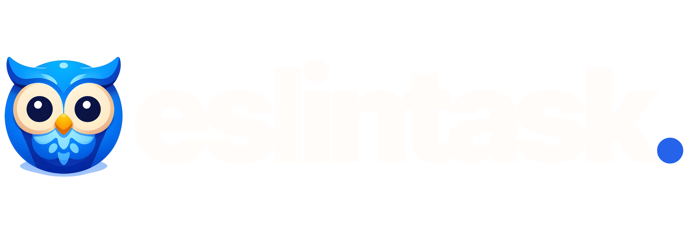
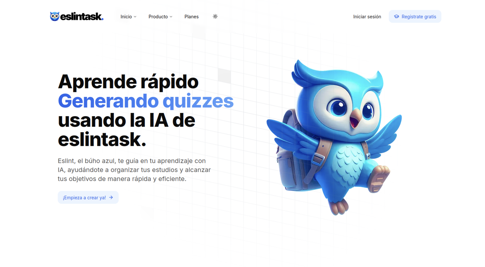

<p align="center">
  
</p>

<div align="center">


</div>

<h1 align="center">Lleva tus estudios a otro nivel</h1>

<div align="center">
    
</div>

## Recursos 

Este proyecto utiliza los siguientes recursos:

- **Next.js**: Un framework de React para la creación de aplicaciones web.
- **TypeScript**: Un superset de JavaScript que añade tipos estáticos.
- **React**: Una biblioteca de JavaScript para construir interfaces de usuario.
- **Clerk Auth**: Una solución de autenticación para aplicaciones web.
- **Appwrite**: Backend as a Service para almacenamiento, bases de datos...
- **Magic UI**: Una biblioteca de componentes UI para crear interfaces de usuario atractivas.
- **shadcn**: Una librería de componentes UI para aplicaciones web.
- **Headless UI**: Otra librería de componentes UI para aplicaciones web.

## Uso

Para configurar el proyecto, sigue estos pasos:

1. Clona el repositorio:
    ```bash
    git clone <URL_DEL_REPOSITORIO>
    ```

2. Navega al directorio del proyecto:
    ```bash
    cd eslintask
    ```

3. Instala las dependencias:
    ```bash
    npm install
    ```

4. Crea un archivo `.env.local` en la raíz del proyecto con las siguientes claves:
    ```env
    CLERK_PUBLIC_KEY=your_public_key
    CLERK_PRIVATE_KEY=your_private_key

    NEXT_PUBLIC_CLERK_SIGN_IN_URL=/sign-in
    NEXT_PUBLIC_CLERK_SIGN_UP_URL=/sign-up

    NEXT_PUBLIC_CLERK_SIGN_IN_FORCE_REDIRECT_URL=/dashboard
    NEXT_PUBLIC_CLERK_SIGN_UP_FORCE_REDIRECT_URL=/dashboard
    
    NEXT_PUBLIC_APPWRITE_PROJECT_ID=your_public_project_id
    NEXT_PUBLIC_DATABASE_ID=your_public_database_id
    NEXT_PUBLIC_TODOS_COLLECTION_ID=your_public_collection_id
    NEXT_PUBLIC_IMAGES_STORAGE_ID=your_public_storage_id
    
    ```

Asegúrate de reemplazar `your_public_key` y `your_private_key` con tus claves de Clerk correspondientes y los id de Appwrite.

## Estado del Proyecto

>[!IMPORTANT] 
> Este proyecto se encuentra actualmente en desarrollo. Algunas funcionalidades pueden no estar completamente implementadas o pueden cambiar en el futuro.